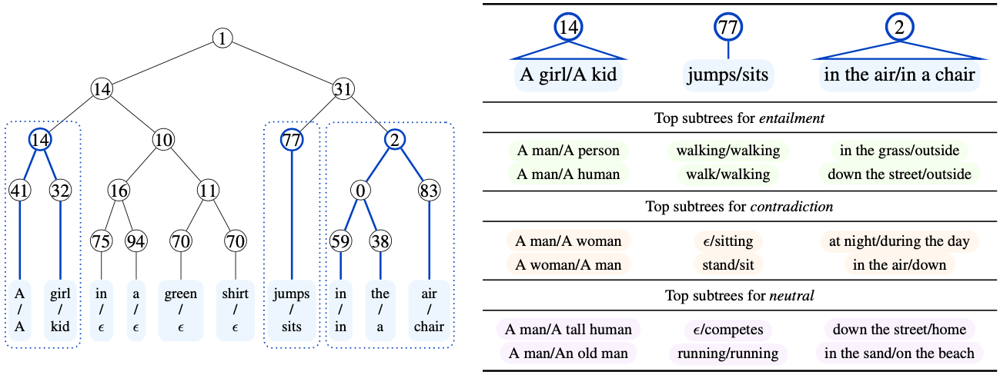

# Finding Dataset Shortcuts with Grammar Induction

This repository contains our code for using grammar induction to find shortcuts in NLP datasets, described in our EMNLP 2022 paper, [Finding Dataset Shortcuts with Grammar Induction](https://arxiv.org/pdf/2210.11560.pdf).
The code can be used to induce context free grammars for text classification datasets and synchronous CFGs for sentence-pair classification datasets, and then search the grammar to find discriminative features.
Please see our paper for more details.




## Quick links
* [Setup](#Setup)
  * [Install dependencies](#Install-dependencies)
  * [Download the data](#Download-the-data)
* [Grammar induction](#Grammar-induction)
  * [Training](#Training)
  * [Parsing](#Parsing)
  * [Using your own data](#Using-your-own-data)
  * [Scaling considerations](#Scaling-considerations)
* [Finding features](#Finding-features)
* [Trained models](#Trained-models)
  * [Grammar checkpoints](#Grammar-checkpoints)
  * [Precomputed parse trees](#Precomputed-parse-trees)
* [Questions?](#Questions)
* [Citation](#Citation)

## Setup

### Install dependencies

Install [PyTorch](https://pytorch.org/get-started/locally/) and then install the remaining requirements: `pip install -r requirements.txt`.
Some additional requirements are needed to run the notebooks:
```
pip install jupyter matplotlib seaborn
```
This code was tested using Python 3.8 and PyTorch version 1.12.1.

### Download the data

We package the data used in our experiments at [this link](https://huggingface.co/princeton-nlp/shortcut_grammar/resolve/main/data.tar.gz). To prepare the data:
```
wget https://huggingface.co/princeton-nlp/shortcut_grammar/resolve/main/data.tar.gz
tar -xzvf data.tar.gz
```
We use the Subjectivity analysis dataset
([Pang and Lee, 2004](https://www.cs.cornell.edu/people/pabo/movie-review-data/)),
the IMDb movie review dataset
([Maas et al., 2011](https://ai.stanford.edu/~amaas/data/sentiment/)),
and subsets of the Stanford NLI dataset
([Bowman et al., 2015](https://nlp.stanford.edu/projects/snli/))
and the Quora Question Pairs dataset
([Iyer et al., 2017](https://quoradata.quora.com/First-Quora-Dataset-Release-Question-Pairs)).

## Grammar induction

### Training

The grammar induction code can be run with a command like the following:
```bash
python src/run.py \
  --train_on subj \
  --model_type pcfg \
  --preterminals 64 \
  --nonterminals 32 \
  --max_length 128 \
  --epochs 40 \
  --train_batch_size 4 \
  --eval_batch_size 4 \
  --eval_on_train_datasets subj \
  --output_dir output/subj/pcfg;
```

The [scripts](scripts/) directory contains scripts to run grammar induction experiments with the settings used in the paper. For example:
```bash
DATASET=subj bash scripts/pcfg.sh
```
```bash
DATASET=snli bash scripts/spcfg.sh
```
These scripts use four GPUs and were run on NVIDIA RTX 3090 GPUs with 24 GB of memory each (but see [Scaling](#Scaling) below).

### Parsing

You can parse new sentences by loading a pretrained grammar model.
For example, if we have a file with one example: 
```bash
echo '[{"a": {"text": "A dog is playing in the park."}, "b": {"text": "A cat is outside."}}]' > data/nli.json
```
This command will parse the examples and write the output to `output/nli/`.  
The argument to `--load_from` should contain a file called `model.pt` storing the grammar parameters and a file called `tokenizer.json` storing the vocabulary:
```bash
python src/run.py  \
   --eval_on data/nli.json \
   --load_from models/snli/ \
   --model_type spcfg \
   --preterminals 64 \
   --nonterminals 32 \
   --eval_batch_size 1 \
   --output_dir output/nli \
   --cache "";
```
(Set `load_tokenizer_from` to load a HuggingFace tokenizer from somewhere else.)
The maximum likelihood trees will be written to a json file in `output_dir`. The trees are written in a nested parenthesis format that can be processed with NLTK. For example, the command:
```bash
jq ".[0].tree" output/nli/predictions.data_nli.json | python -c "import sys,nltk; print(nltk.tree.Tree.fromstring(sys.stdin.read()[1:-2]))"
```
should print:
```
(9
  (1
    (14 (82 a/a) (32 dog/cat))
    (31
      (61 is/is)
      (19
        (50 playing/)
        (2 (16 (75 in/) (94 the/)) (47 park/outside)))))
  (67 ./.))
```

### Using your own data

You can use this script to train on your own data, or parse new sentences, by supplying files in json format.
For single sentence datasets, the expected format is `[{"text": "A sentence."}]` and for sentence pair datasets, the expected format is 
`[{"a": {"text": "First sentence"}, "b": {"text": "Second sentence"}}]`.
Provide the complete path as an argument to `--train_on` and `--eval_on`.

### Scaling

The main scaling consideration is memory, which is required to run the chart parsing algorithms for grammar induction and parsing, and scales with input length.
We use width-batched versions of the inside algorithm implemented using [Torch-Struct](https://github.com/harvardnlp/pytorch-struct), and the chart size is $O(|x|^2|\mathcal{N}|)$ for PCFG and $O(|x^a|^2|x^b|^2|\mathcal{N}|)$ for the SPCFG, where $|x^a|, |x^b|$ are the lengths of the two sentences in a pair and $|\mathcal{N}|$ is the number of nonterminal symbols.
If you run out of memory, you can restrict the input length (with `--max_length` and `--max_eval_length`) or reduce the number of nonterminal symbols (`--nonterminal`).
In the case of the SPCFG, `--max_length` refers to the product of $|x^a|$ and $|x^b|$.
We have verified the following settings, using 32 nonterminals and 64 preterminals. 

| Grammar | GPU memory | `batch_size` | `max_length` |
| :---    |       ---: |         ---: |         ---: |
| PCFG    | 11 GB      | 4            | 75           |
| PCFG    | 24 GB      | 4            | 125          |
| SPCFG   | 11 GB      | 1            | 175          |
| SPCFG   | 24 GB      | 1            | 225          |

## Finding features

Utilities for finding features from the grammar are provided in [src/features/](src/features/) and illustrated in the Jupyter notebooks for each of the datasets we used:

* [SNLI](notebooks/snli_features.ipynb)
* [QQP](notebooks/qqp_features.ipynb)
* [IMDb](notebooks/imdb_features.ipynb)
* [Subjectivity](notebooks/subj_features.ipynb)

## Trained models

### Grammar checkpoints

The parameters of the grammars we trained are  available at [this link](https://huggingface.co/princeton-nlp/shortcut_grammar/):

| Dataset | Model | Tokenizer |
|---|---|---|
| Subjectivity | [Model](https://huggingface.co/princeton-nlp/shortcut_grammar/resolve/main/subj/model.pt) | [Tokenizer](https://huggingface.co/princeton-nlp/shortcut_grammar/resolve/main/subj/tokenizer.json) |
| IMDb | [Model](https://huggingface.co/princeton-nlp/shortcut_grammar/resolve/main/imdb/model.pt) | [Tokenizer](https://huggingface.co/princeton-nlp/shortcut_grammar/resolve/main/imdb/tokenizer.json) |
| SNLI | [Model](https://huggingface.co/princeton-nlp/shortcut_grammar/resolve/main/snli/model.pt) | [Tokenizer](https://huggingface.co/princeton-nlp/shortcut_grammar/resolve/main/snli/tokenizer.json) |
| QQP | [Model](https://huggingface.co/princeton-nlp/shortcut_grammar/resolve/main/qqp/model.pt) | [Tokenizer](https://huggingface.co/princeton-nlp/shortcut_grammar/resolve/main/qqp/tokenizer.json) |

### Parse trees

Parse trees from the grammars we used in the paper are included in the data release:
```
wget https://huggingface.co/princeton-nlp/shortcut_grammar/resolve/main/data.tar.gz
tar -xzvf data.tar.gz
```
The trees are stored in a column called `trees` in a nested parenthesis format:
```
>>> import pandas as pd; from nltk.tree import Tree
>>> snli = pd.read_csv("data/snli/train.tsv", delimiter="\t")
>>> print(Tree.fromstring(snli["tree"][0]))
(9
  (1
    (1
      (14 (41 a/the) (32 child/child))
      (31
        (21 (46 holding/has) (64 snow/rosy))
        (2 (16 (75 in/) (94 his/)) (47 hand/cheeks))))
    (2
      (0 (0 (55 amongst/from) (41 a/the)) (85 snowy/))
      (83 background/cold)))
  (90 ./))
```

## Questions?

If you have any questions about the code or paper, feel free to email Dan (dfriedman@princeton.edu) or open an issue.

## Citation
```bibtex
@inproceedings{friedman2022finding,
   title={Finding Dataset Shortcuts with Grammar Induction},
   author={Friedman, Dan and Wettig, Alexander and Chen, Danqi},
   journal={Empirical Methods in Natural Language Processing (EMNLP)},
   year={2022}
}
```
